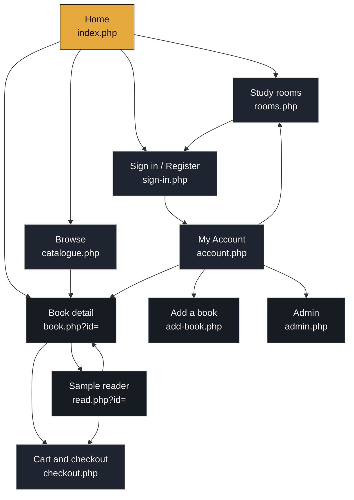
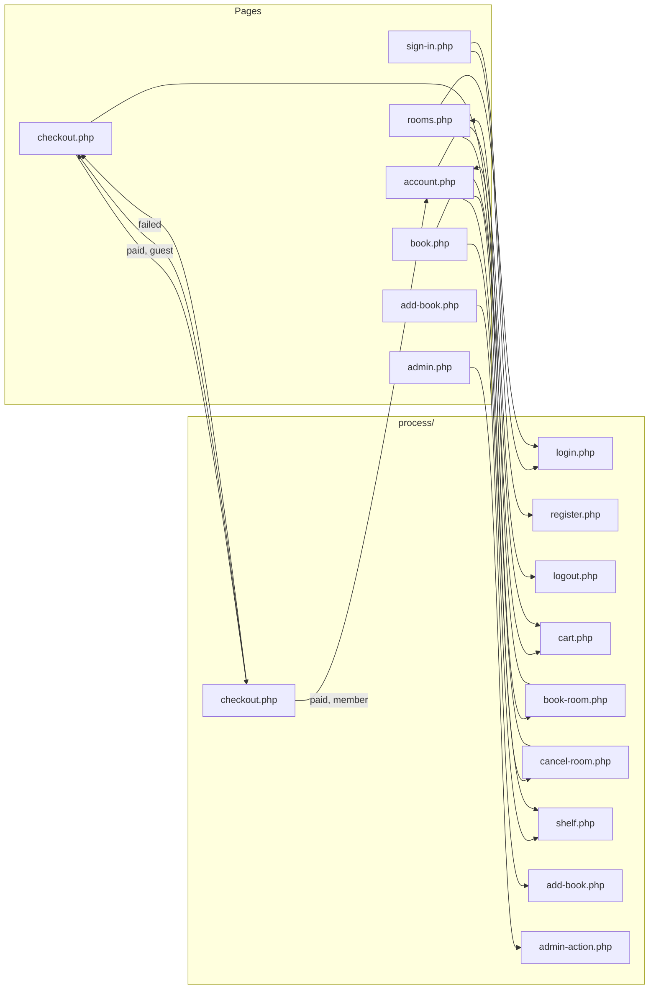

# BookNest: Site map

One home page and nine content pages (the course allows at most ten). Every page shares the
same header (logo, navigation, search, cart, account) and footer, so every page is one click
from Home, Browse, Study Rooms, Cart and Account. The hierarchy is wide and shallow: nothing
is more than three levels from the home page.

## Page hierarchy

Levels: **Home** (level 1) → **Browse, Study Rooms, Cart, Account, Sign in** (level 2, all in the global header) → **Book, Reader, Add a book, Admin** (level 3).

## Access by role

| Page | Visitor | Member | Admin |
|---|---|---|---|
| Home, Browse, Book, Reader, Checkout | Yes | Yes | Yes |
| Study Rooms (view table) | Yes | Yes | Yes |
| Study Rooms (book) | Inline sign in | Yes | Yes |
| Sign in / Register | Yes | Redirects to My Account | Redirects to My Account |
| My Account | Redirects to Sign in | Yes | Yes |
| Add a book | Redirects to Sign in | Yes | Yes |
| Admin | Redirects to Sign in | Refused, back to Home | Yes |

## Form endpoints (not pages)

Forms post to scripts in `process/`. They never output HTML: they validate, write to the
database, set a message and redirect back (Post/Redirect/Get).

