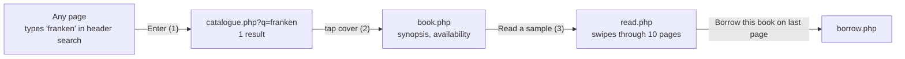
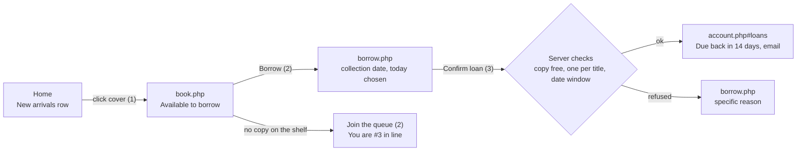
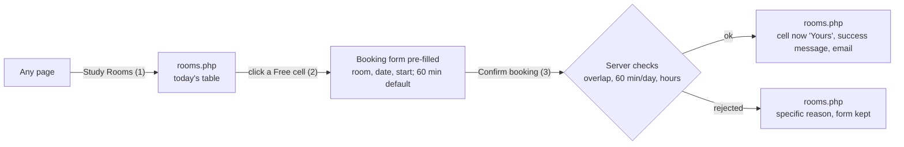

# BookNest: Storyboard and Three Click audit

## User scenarios

### Scenario 1: Find a book and read a sample (Nadia, 19, student, on her phone)

Nadia heard about *Frankenstein* in a lecture and wants to see if she would enjoy it.

| Step | Screen | What she sees | Click |
|---|---|---|---|
| 1 | Header search | Types "franken", presses Enter | 1 |
| 2 | Catalogue | "1 book matches franken", one cover card | 2 |
| 3 | Book detail | Cover, synopsis, "Read a sample" as a clear secondary button | 3 |
| 4 | Reader | A single paper page; she swipes left to turn | swipe |
| 5 | End of sample | "Enjoying it?" with Borrow this book and Back to book | optional |

From the home page she can also tap the billboard or a row card directly, which cuts it to 2 clicks.

### Scenario 2: Borrow a book (Mr Tan, 52, member, on a laptop)

Borrowing is free, so there is no payment step. The collection date defaults to today, which
keeps the normal path at three clicks. A visitor who presses "Sign in to borrow" is returned to
the same borrow form after signing in. When every copy is out, the Borrow button becomes
"Join the queue", one click; when a copy is returned the first person in line gets an email
and the copy is held for them for two days.

### Scenario 2b: Return a book (Mr Tan, two weeks later)

My Account (1), Return (2), Yes, return it (3). If the book is late, the confirmation states the
fee ("It was 3 days late, so a late fee of S$1.50 was added to your account"), and the fee stops
growing from that day.

### Scenario 3: Book a study room (Aisha, member)

Later she cancels: My Account (1), Cancel (2), Yes, cancel (3). Her daily hour is freed.

If a visitor clicks a Free cell, the booking panel shows an inline sign in form. After signing
in they return to the same pre-filled slot, so booking needs one extra submit only for the
first visit. This is the one documented exception to the rule.

---

## Three Click audit

A click is a link, button or form submit. Typing, swiping and scrolling do not count.
Counted for a signed in member starting on any page unless noted.

| # | Task | Path | Clicks | Test |
|---|---|---|---|---|
| 1 | Find a book by title | Search, Enter (1), result (2) | 2 | T39 |
| 2 | Browse a category | Category chip or row title (1), book (2) | 2 | T39 |
| 3 | Read a sample | Cover (1), Read a sample (2) | 2 | T39 |
| 4 | Borrow one book (member) | Cover (1), Borrow (2), Confirm loan (3) | 3 | T39 |
| 4b | Join a queue for a book with no copy left | Cover (1), Join the queue (2) | 2 | T39 |
| 4c | Return a book | My Account (1), Return (2), Yes, return it (3) | 3 | T39 |
| 5 | Book a study room | Study Rooms (1), Free cell (2), Confirm (3) | 3 | T39 |
| 6 | Cancel a booking | My Account (1), Cancel (2), Yes, cancel (3) | 3 | T39 |
| 7 | Save a book to My Shelf | Cover (1), Save to shelf (2) | 2 | T39 |
| 8 | Add a new book | Add a book (1), Submit (2) | 2 | T39 |
| 9 | Look up a serial number | Type serial in search, Enter (1) | 1 | T39 |
| 10 | Check opening hours | Visible in the footer of every page | 0 | T39 |
| 11 | Sign out | My Account (1), Sign out (2) | 2 | T39 |

Design decisions that keep these numbers low:

- **Search in the header of every page**, so finding starts anywhere.
- **Borrow** opens a one field form with today already chosen; **Join the queue** is a single button on the book page.
- **Free cells are links** that pre-fill the form; duration defaults to 60 minutes.
- **Account links are plain links**, not a dropdown menu that costs a click to open.
- **Opening hours live in the footer**, not on a separate page.
